

# 理解矩阵

1. [理解矩阵（一）](https://blog.csdn.net/myan/article/details/647511)
2. [理解矩阵（二）](https://blog.csdn.net/myan/article/details/649018)
3. [理解矩阵（三）](https://blog.csdn.net/myan/article/details/1865397)

**总结：**

- **“空间”是容纳运动的一个对象集合，而变换则规定了对应空间的运动。**
- **矩阵的本质是运动的描述。**
- **所谓变换，其实就是空间里从一个点（元素/对象）到另一个点（元素/对象）的跃迁**
- **矩阵是线性空间里的变换的描述，矩阵与向量相乘，就是实施运动（变换）的过程。**
- **矩阵是线性空间中的线性变换的一个描述。在一个线性空间中，只要我们选定一组基，那么对于任何一个线性变换，都能够用一个确定的矩阵来加以描述。**
- **所谓相似矩阵，就是同一个线性变换的不同的描述矩阵，它们的本质是一样的，所以本征值相同。**
- **矩阵不仅可以作为线性变换的描述，而且可以作为一组基的描述。而作为变换的矩阵，不但可以把线性空间中的一个点给变换到另一个点去，而且也能够把线性空间中的一个坐标系（基）表换到另一个坐标系（基）去。而且，变换点与变换坐标系，具有异曲同工的效果。（运动等价于坐标系的变换，即运动是相对的！）**

-------

# Linear Algebra Done Right

## Vector Spaces

1. A ***vector space*** is a set V along with an addition on V and a scalar
   multiplication on V such that the following **properties** hold:

   - **commutativity**

     ​	$u+v=v+u$ for all $u,v \in V$ ;

   - **associativity**

     ​	$(u+v)+w=u+(v+w)$ and $(ab)v=a(bv)$ for all $u,v,w \in V $ and all $a,b\in F$ ;

   - **additive identity** (must be unique)

     ​	there exists an element $0\in V$ such that $v+0=v$ for all $v\in V$

   - **additive inverse**  (must be unique)

     ​	for every $v\in V$, there exists $w\in V$ such that $v+w=0$ ;

   - **multiplication identity**

     ​	$1v=v$ for all $v\in V$ ;

   - **distributive properties**

     ​	$a(u+v)=au+av$ and $(a+b)u=au+bu$ for all $a,b\in F$ and all $u,v\in V$

   **Polynomial**  is also a vector space

2. **Propositions**:

   - $0v =0$ for every $v \in V$.
   - $a0=0$ for every $a∈F.$ 
   - $(−1)v =−v$ for every $v \in V$ .

   **Remember that the $0, -1$ above may not be the regular $0, -1$ as we known, they denote additive inverse and additive identity of the specific operation**(pending)

3. **Subspaces**：If $U$ is a subset of $V$, then to check that $U$ is a subspace of $V$ we need only check that $U$ satisfies the following: 

   - **additive identity** : $0∈U; $ 
   - **closed under addition** : $u,v ∈U $ implies $u+v ∈U; $
   - **closed under scalar multiplication** : $a∈F$ and $u∈U$ implies $au∈U$. 

   A subspace can be regard as a large space with some properties being limited

4. **Sums and Direct Sums**： Specifically, we say that $V$ is the direct sum of subspaces$ U_1 ,...,U_m$, 

   (1)  $V =U_1 ⊕···⊕U_m$, 

   (2) each element of $V$ can be written **uniquely** as a sum $u_1+\dots +u_m$, where each $u_j \in U_j$.

   **Proposition**: Suppose that $U$ and $W$ are subspaces of $V$. Then $V =U⊕W$ if and only if $V =U+W$ and $U∩W =\{0\}$.  (only with the case of two subspaces). 

   $$V =U⊕W  \Leftrightarrow  V =U+W  \&  U∩W =\{0\}$$

   

## Finite-Dimensional Vector Spaces

### Span and Linear Independence 

1. **The set of all linear combinations of $(v_1,...,v_m)$ is called the span of $(v_1,...,v_m)$, denoted $span(v_1,...,v_m)$.**

   $$span(v_1,...,v_m)=\lbrace a_1v_1+···+a_mv_m : a_1,...,a_m ∈F\rbrace. $$

    the span of any list of vectors in $V$ is a subspace of $V$.

2. **Infinite-dimensional** vector spaces are the center of attention in the branch of mathematics called *functional analysis*.

3. A list $(v_1,...,v_m)$ of vectors in $V$ is called **linearly independent** if the only choice of $a_1 ,...,a_m ∈F$ that makes $a_1 v_1 +···+a_mv_m$ equal $0$ is $a_1 =···=a_m =0.$

### Bases

A basis of $V$ is a list of vectors in $V$ that is linearly independent and spans $V.$ 

1. A list $(v_1,...,v_n)$ of vectors in $V$ is a basis of $V$ if and only if every $v ∈V$ can be written uniquely in the form

   $$ v =a_1v_1+···+a_nv_n$$

   where $a_1,...,a_n ∈F$.

2. Every spanning list in a vector space can be reduced to a basis of the vector space.

3.  Every linearly independent list of vectors in a finite-dimensional vector space can be extended to a basis of the vector space.

4.  Suppose $V$ is finite dimensional and $U$ is a subspace of $V$. Then there is a subspace W of $V$ such that $V =U⊕W.$

### Dimension

1. If $V$ is finite dimensional and $U$ is a subspace of $V$, then $dimU ≤dimV.$ 

2. If $U_1$ and  $U_2$ are subspaces of a finite-dimensional vector space, then 

   $dim(U_1+U_2)=dimU_1+dimU_2−dim(U_1∩U_2)$.

   - It is same as the number of elements in the union of  two finite sets: 
     $$
     n(A+B)=n(A)+n(B)-n(A\cap B)​
     $$

3. Suppose V is finite dimensional and $U1,...,Um$ are subspaces of V such that

   $$V =U_1+···+U_m$$ 

   and  

   $$dimV =dimU_1+···+dimU_m$$.

   Then $V =U_1⊕···⊕U_m$.

   Recall that direct sum is analogous to disjoint union. 

   - In sets:

     If $B=A_1 \cup \dots A_m$, and $n(B)=n(A_1)+\dots+n(A_m)$, then the union is a disjoint union.

## Linear Maps

### Definitions and Examples 

A linear map from $V$ to $W$ is a function $T$ : $V →W$ with the following properties: 

- **additivity** : $T(u+v)=Tu+Tv$ for all $u,v ∈V$; 
- **homogeneity** :  $T(av)=a(Tv)$ for all $a∈F$ and all $v ∈V.$ 

 For $S,T ∈L(V,W),$ 

- **associativity** 
   $$
   (T_1 T_2 )T_3 =T_1 (T_2 T_3 )​
   $$

- **identity** 

   $$
   TI=T​ and IT =T​
   $$

- **distributive properties** 
  $$
  (S_1 +S_2 )T = S_1 T +S_2 T and S(T_1 +T_2 ) = ST_1 +ST_2
  $$

- Multiplication of linear maps is **not commutative**. 

  $$
  ST \neq TS​
  $$

### Null Spaces and Ranges 

1. $null T ={v ∈V : Tv=0}$ 

   - If $T ∈L(V,W)$, then $null T$ is a subspace of $V$. 

   - Let $T ∈L(V,W)$. Then $T$ is **injective（单射）** if and only if $nullT ={0}$. 

     (A linear map $T: V → W$ is called injective if whenever $u,v ∈ V$ and $Tu = Tv$, we have $u = v$.)

2. $rangeT ={Tv: v ∈V}$

   -  If $T ∈L(V,W)$, then $rangeT$ is a subspace of $W$. 
   - A linear map $T: V → W$ is called **surjective（满射）** if its range equals $W$.

3. If $V$ is finite dimensional and $T ∈L(V,W)$, then $rangeT$ is a finite-dimensional subspace of $W$ and 

   $dimV =dim nullT +dimrangeT$

4.  If $V$ and $W$ are finite-dimensional vector spaces such that  $dimV>dimW$, then no linear map from $V$ to $W$ is **injective**. 
   $$
   dimnullT =dimV −dimrangeT \ge dim V-dimW >0
   $$

5.  If $V$ and $W$ are finite-dimensional vector spaces such that ,  $dimV<dimW$then no linear map from $V$ to $W$ is **surjective**.
   $$
   dimrangeT =dimV −dimnullT ≤dimV < dimW​
   $$
   

**Conclusions:**

1. A homogeneous system of linear equations in which there are more variables than equations must have nonzero solutions.

2. An inhomogeneous system of linear equations in which there are more equations than variables has no solution for some choice of the constant terms.

### The Matrix of a Linear Map

$$
M(T)=\left[
\begin{matrix}
a_{1,1} & \dots & a_{1,n} \\
\vdots &  & \vdots \\
a_{m,1} & \dots & a_{m,n}
\end{matrix}
\right]
$$

Let $T ∈L(V,W)$. Suppose that $(v_1,...,v_n)$ is a basis of $V$ and $(w_1,...,w_m)$ is a basis of $W$. 
$$
Tv_k =a_{1,k}w_1+···+a_{m,k}w_m,
$$
Sthe matrix of $T$ with respect to the bases $(v_1,...,v_n)$ and $(w_1,...,w_m)$; we denote it by 
$$
M(T,(v_1,...,vn),(w_1,...,w_m))
$$

$$
M(Tv)=\left[
\begin{matrix}
a_{1,1}b_1+ \dots+ a_{1,n}b_n \\
\vdots \\
a_{m,1}b_1+ \dots+  a_{m,n}b_n
\end{matrix}
\right]
$$

### Invertibility

A linear map $T ∈L(V,W)$ is called invertible if there exists a linear map $S ∈L(W,V)$ such that $ST$ equals the identity map on $V$ and $TS$ equals the identity map on W. 

-  A linear map is **invertible** if and only if it is **injective** and **surjective**. 

- Two vector spaces are called **isomorphic（同构）** if there is an invertible linear map from one vector space onto the other one.

  -  two isomorphic spaces have the same properties; 
  - we can think of an invertible linear map as a **relabeling** of the elements of a vector space. 
  - Two finite-dimensional vector spaces are isomorphic if and only if they have the **same dimension.**

-  If $V$ and W are finite dimensional, then $L(V,W)$ is finite dimensional and 
  $$
  dimL(V,W)=(dimV)(dimW).
  $$

- Suppose $V$ is finite dimensional. If $T ∈L(V)$, then the following are equivalent: 

  - $T$ is invertible; 
  - $T$ is injective;
  - $T$ is surjective.

## Polynomials

Recall that a function $p: F → F$ is called a polynomial with coefficients in $F$ if there exist $a_0,...,a_m ∈F$ such that 
$$
p(z)=a_0+a_1 z+a_2z_2+···+a_mz_m
$$

### Degree

1. If all the coefficients $a_0,...,a_m$ equal $0$, then we say that $p$ has degree $−∞$.

2. A polynomial may have **more than one** degree.

3.  A number $λ∈F$ is called a **root** of a polynomial $p∈P(F)$ if 
   $$
   p(λ)=0
   $$

4. Suppose $p ∈P (F)$ is a polynomial with degree $m ≥ 1$ . Let $λ ∈ F$. Then λ is a root of $p$ if and only if there is a polynomial $q∈P(F)$ with degree $m−1$ such that
   $$
   p(z)=(z−λ)q(z)
   $$

5. Suppose $p∈P(F)$ is a polynomial with degree $m≥0$. Then $p$ has at most $m$ distinct roots in $F$. 

6. Suppose $a_0,...,a_m ∈F.$ If 
   $$
   a_0+a_1 z+a_2z^2+···+a_mz^m =0
   $$
    for all $z∈F$, then $a_0 =···=a_m =0$. 

   It implies that $(1,z,\dots,z^m)$ is linearly independent in $P(F)$ for every nonnegative integer $m$.

7. **Division Algorithm:**  Suppose $p,q ∈P (F),$ with $p \neq 0$. Then there exist polynomials $s,r ∈P(F)$ such that 
   $$
   q=sp+r
   $$
   and $\deg r<\deg p$

## Eigenvalues and Eigenvectors

### Invariant Subspaces

1. For $T ∈L(V)$ and $U$ a subspace of $V$, we say that $U$ is **invariant under $T$** if $u ∈ U$ implies $Tu∈ U$. In other words, $U$ is invariant under T if $T|_U$ is an operator on $U$. 
2. If $T\in L(V)$, $null T$ and $range T$ is invariant under $T$.
3.  **Eigenvalue** : Specifically, a scalar $λ ∈ F$ is called an **eigenvalue** of $T ∈L(V)$ if there exists a nonzero vector  $u ∈ V$ such that $Tu= λu$.
4. The equation $Tu= λu$ is equivalent to $(T −λI)u = 0$, so $λ$ is an eigenvalue of $T$ if and only if $T −λI$ is **not injective**.  $λ$ is an eigenvalue of $T$ if and only if $T−λI$ is **not invertible**, and this happens if and only if $T −λI$ is **not surjective**. 
5.  **Eigenvector:** An operator has an eigenvalue if and only if there exists a nonzero vector in its domain that gets sent by the operator to a scalar multiple of itself.
6.  Let $T ∈L(V)$. Suppose $λ_1 ,...,λ_m$ are distinct eigenvalues of $T$ and $v_1 ,...,v_m$ are corresponding nonzero eigenvectors. Then $(v_1 ,...,v_m)$ is linearly independent.

### Upper-Triangular Matrices

1. Every operator on a finite-dimensional, nonzero,  complex vector space has an eigenvalue. 
2. Suppose $T ∈L(V)$ and $(v_1,...,v_n)$ is a basis of $V.$ Then the following are equivalent: 
   -  the matrix of $T$ with respect to $(v_1,...,v_n)$ is upper triangular; 
   -  $Tv_k ∈span(v_1,...,v_k)$ for each $k=1,...,n$ ; 
   -  $span(v_1,...,v_k)$ is invariant under T for each $k=1,...,n$ .
3. Suppose  $T ∈L(V)$ has an upper-triangular matrix with respect to some basis of $V$. Then $T$ is invertible if and only if all the entries on the **diagonal** of that upper-triangular matrix are **nonzero**.
4.  Suppose $T ∈L(V)$ has an upper-triangular matrix with respect to some basis of $V$. Then the **eigenvalues** of $T$ consist precisely of **the entries on the diagonal** of that upper-triangular matrix.

### Diagonal Matrices

1.  An operator $T ∈L(V)$ has a diagonal matrix with respect to some basis of $V$ if and only if $V$ **has a basis consisting of eigenvectors of** $T$. 

2.  If $T ∈L(V)$ has $dimV$ distinct eigenvalues, then $T$ has a diagonal matrix with respect to some basis of $V$.

3. Suppose $T ∈L(V)$. Let $λ_1,...,λ_m$ denote the distinct eigenvalues of $T$. Then the following are equivalent:

   - $T$ has a diagonal matrix with respect to some basis of $V$; 

   - $V$ has a basis consisting of eigenvectors of $T$; 

   - there exist one-dimensional subspaces $U_1,...,U_n$ of $V$, each invariant under $T$, such that $V =U_1⊕···⊕U_n$; 

   - $V =null(T −λ_1I)⊕···⊕null(T −λ_mI)$; 

     >  every vector in V is a linear combination of eigenvectors of T. Hence
     > $$
     > V =null(T −λ_1I)+···+null(T −λ_mI).
     > $$
     > $null(T- \lambda _mI)=\{x|(T-\lambda_mI)x=0\} $, where $x$ is the eigenvector of $\lambda_m$. Thus eigenvectors are linearly independent.  This implies  that the sum is a direct sum.

   -  $dimV =dimnull(T −λ_1I)+···+dimnull(T −λ_mI)$. 

### Invariant Subspaces on Real Vector Spaces

1. Every operator on a *finite-dimensional*, *nonzero*, *real vector space* has an invariant subspace of dimension **$1$ or $2$.**
2.  Every operator on an **odd-dimensional** real vector space has **an eigenvalue**.

## Inner-Product Spaces

### Inner Products

1. the **complex conjugate** of $λ$ is defined by $ \widetilde{\lambda}=a−bi$, 

2. $|λ|^2 =\lambda \widetilde{\lambda}$

3. **Properites** of *inner product*:

   - **positivity** 
     $$
     ⟨v,v⟩≥ 0  \quad \forall v ∈ V;
     $$

   - **definiteness** 
     $$
     ⟨v,v⟩=0 \quad iff \quad v =0;
     $$

   - **additivity in first slot** (also in second slot)
     $$
     ⟨u+v,w⟩=⟨u,w⟩+⟨v,w⟩\quad \forall u,v,w ∈ V;
     $$

   - **homogeneity in first slot** (also in second slot)
     $$
     ⟨av,w⟩=a⟨v,w⟩\quad \forall a∈ F \quad and \quad \forall v,w∈ V;
     $$

   - **conjugate symmetry** 
     $$
     ⟨v,w⟩=\widetilde{⟨w,v⟩}\quad  \forall v,w∈ V.
     $$

4. An ***inner-product space*** is a vector space V along with an inner product on V. 

### Norms

1. $ \lVert (z1 ,...,zn)\rVert=\sqrt{|z1|^2+···+|zn|^2}.$ 

2. $\lVert p\rVert=\sqrt{\int^1_0 |p(x)|^2dx} $ .

3. Two vectors $u,v ∈V$ are said to be orthogonal if $⟨u,v⟩=0$.

4. **Pythagorean Theorem**:  If u,v are orthogonal vectors in V,then 
   $$
   ∥u+v∥^2 =∥u∥^2+∥v∥^2.
   $$

5. **Cauchy-Schwarz Inequality**：If u,v ∈V, then
   $$
   |⟨u,v⟩|≤∥u∥∥v∥.
   $$
   This inequality is an equality if and only if one of $u,v$ is a scalar multiple of the other. 

6. **Triangle Inequality**: If $u,v ∈V$, then
   $$
   ∥u+v∥≤∥u∥+∥v∥.
   $$
   This inequality is an equality if and only if one of $u,v$ is a nonnegative multiple of the other.

7. **Parallelogram Equality**: If $u,v ∈V$, then 
   $$
   \lVert u+v\rVert^2 +∥u−v∥^2 =2 (∥u∥^2 +∥v∥^2 ).
   $$
   

教材：[矩阵理论与应用](./矩阵理论与应用（教材）.pdf)

# 第一章 线性代数概要与提高

## 引言

线性代数讨论的两个问题

1. 引入矩阵来解线性方程组

   - 线性方程组简洁地表示为 $Ax = b$

   - 二次型表示为
     $$
     f(x)=f\left(x_{1}, x_{2}, \cdots, x_{n}\right)=\sum_{i, j=1}^{n} a_{i j} x_{i} x_{j}
     $$
     即为 $f(x) = x^TAx$.  因此线性方程组解的存在性取决于系数矩阵A与增广矩 阵(A,b)的秩相等与否.
   
  - 将线性方程组Ax = b再次改写为向量形式
    $$
    x_{1} \alpha_{1}+x_{2} \alpha_{2}+\cdots+x_{n} \alpha_{n}=b
    $$
    线性方程组的解实际上是向量$b$关于$A$的列$α_1,··· ,α_n$的组合系数. 
  
  - 通过研究齐次线性方程组$Ax = 0$的解的结构, 可以知道任意解均可表为任一基础解系的线性组合, 而$Ax = b$如果有解, 则可将其化为相应的齐次线性方程组.

2. 矩阵乘法

   - 理解$n$阶方阵$A$的高次幂$A^m$是理解矩阵乘法的关键(也是理解和化简二次型的关键). 

   - 利用特征值与特征向量, 一些矩阵可以化为对角形, 即存在可逆矩阵P使得 $P^{-1} A P=D=\operatorname{diag}\left(\lambda_{1}, \lambda_{2} \cdots, \lambda_{n}\right)$,  因此
     $$
     A^{m}=P D^{m} P^{-1}=P \operatorname{diag}\left(\lambda_{1}^{m}, \lambda_{2}^{m} \cdots, \lambda_{n}^{m}\right) P^{-1}
     $$

     特别地, 实对称矩阵可以正交对角化, 即存在正交矩阵Q使得 
     $$
     Q^{-1} A Q=Q^{T} A Q=\operatorname{diag}\left(\lambda_{1}, \lambda_{2} \cdots, \lambda_{n}\right)
     $$
     于是利用坐标变换x = Qy即可将实二次型f(x) = xTAx化为标准型
     $$
     f=\lambda_{1} y_{1}^{2}+\lambda_{2} y_{2}^{2}+\cdots+\lambda_{n} y_{n}^{2}
     $$

## 矩阵乘法与分块矩阵

### 乘法证明

1. 第$i$行第$j$列元素为$1$, 其余元素均为$0$的$m×n$矩阵称为基本矩阵, 记为$E_{ij} ,1≤ i ≤ m, 1≤ j ≤ n$ . 任意$m×n$矩阵$A = (a_{ij})$均能唯一地表示成 

$$
\begin{aligned} A &=\left( \begin{array}{cccc}{a_{11}} & {a_{12}} & {\cdots} & {a_{1 n}} \\ {a_{21}} & {a_{22}} & {\cdots} & {a_{2 n}} \\ {\cdots} & {\cdots} & {\cdots} & {\cdots} \\ {a_{m 1}} & {a_{m 2}} & {\cdots} & {a_{m n}}\end{array}\right) \\ &=\sum_{i=1}^{m} \sum_{j=1}^{n} a_{i j} E_{i j} \end{aligned}
$$

因为
$$
E_{i j} E_{k l}=\delta_{j k} E_{i l}, \quad 1 \leq i \leq m, 1 \leq j, k \leq p, 1 \leq l \leq n
$$
其中
$$
\delta_{j k}=\left\{\begin{array}{l}{1}, \quad j=k\\ {0},\quad else\end{array}\right. 
$$
于是矩阵的乘法可表为:
$$
\begin{aligned} A B &=\left(\sum_{i=1}^{m} \sum_{j=1}^{p} a_{i j} E_{i j}\right)\left(\sum_{i=1}^{p} \sum_{j=1}^{n} b_{i j} E_{i j}\right) \\ &=\sum_{i, j, k, l}\left(a_{i j} E_{i j}\right)\left(b_{k l} E_{k l}\right)=\sum_{i, j, k, l}\left(a_{i j} b_{k l}\right)\left(E_{i j} E_{kl})\right.\\ &=\sum_{i, j, k, l}\left(a_{i j} b_{k l}\right)\left(\delta_{j k} E_{i l}\right)=\sum_{i, j, k, l}\left(\delta_{j k} a_{i j} b_{k l}\right) E_{i l} \\ &=\sum_{i=1}^{m} \sum_{j=1}^{n}\left(\sum_{k=1}^{p} a_{i k} b_{k j}\right) E_{i j} \end{aligned}
$$
即乘积AB的第i行第j列的元素等于$\sum_{k=1}^{p} a_{i k} b_{k j}$, 这正是矩阵乘法的“左行右列”规则

2. 矩阵乘一个列向量等于该矩阵所有列的线性组合, 组合系数即是该列向量的对应元素. 同理, 一个行向量左乘一个矩阵等于该矩阵所有行的线性组合, 组合系数即是该行向量的对应元素
   $$
   C_{j}=A B_{j}, \quad C^{i}=A^{i} B
   $$
   即矩阵AB的第j列是A的列向量的线性组合, 组合系数恰为矩阵B的第j列的相应元素; AB的 第i行是B的行向量的线性组合, 组合系数恰为矩阵A的第i行的相应元素. 

3. 方程组$Ax = b$有解 $⇐⇒$ $b$是系数矩阵A的列的线性组合 $⇐⇒ r(A) = r(A,b)$, 即系数矩阵的秩等于增广矩阵的秩. 
4. 齐次线性方程组$Ax = 0$有非零解 $⇐⇒ A$的列向量线性相关; 有唯一解(即零解)$⇐⇒ A$的列向量线性无关.

### 行列式

$n$阶方阵$A = (a_{ij})$的行列式记为$|A|$(另一个通用记号是$detA$), 它具有性质$|AB| = |A||B|.$ 

### 迹

方阵$A$的**迹** $trA$ 是$A$的对角线元素之和 $\sum_{i=1}^na_{ii}$

**性质：**

### 秩 逆矩阵

矩阵A的所有不为零的子式的最高阶数称为矩阵A的**秩**, 记为$r(A)$. 约定零矩阵的秩是0. 

#### 逆矩阵

对n阶方阵而言, “秩为n”(也称为“**满秩**”), “**非奇异**”与“**可逆**”是等价的三个概念. 可逆矩阵的逆矩阵是唯一的, 记为$A^{−1}$. 逆矩阵具有下述**性质**:

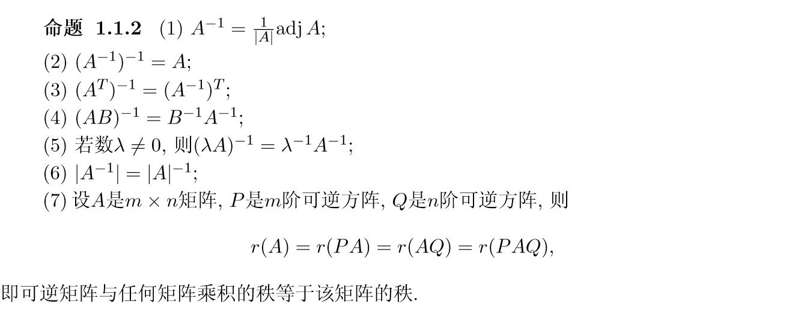

由于矩阵可以看作基下的变换, 因此秩就是**变换后的空间维度**. **列空间**是**变换后基的坐标**, 因此秩也相当于变换后列空间的维数

矩阵秩的另一个极端是1. 一个非零矩阵A的秩为$1 ⇐⇒ A$是一个非零列矩阵与一个非零行矩阵的乘积, 即存在列向量$α,β$使得$A = αβ^T$. 因此秩为1的方阵的高次幂可以如下算出:
$$
A^{m}=\left(\alpha \beta^{T}\right)^{m}=\left(\beta^{T} \alpha\right)^{m-1} \alpha \beta^{T}=\left(\beta^{T} \alpha\right)^{m-1} A
$$

#### 矩阵的和与乘积的秩

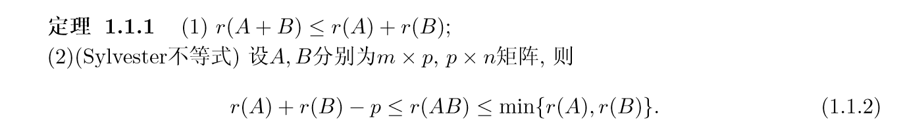

### 余子式 代数余子式 伴随

对任意$n$阶方阵 $A = (a_{ij})$, 去掉第$i$行第$j$列后所剩余的$n−1$阶方阵的行列式称为元素$a_{ij}$ 的**余子式**, 记为$M_{ij}$. 而$(−1)^{i+j}M_{ij}$称为元素$a_{ij}$的**代数余子式**, 记为$A_{ij}$. n阶方阵 
$$
\left( \begin{array}{cccc}{A_{11}} & {A_{21}} & {\cdots} & {A_{n 1}} \\ {A_{12}} & {A_{22}} & {\cdots} & {A_{n 2}} \\ {\cdots} & {\ldots} & {\ldots} & {\cdots} \\ {A_{1 n}} & {A_{2 n}} & {\cdots} & {A_{n n}}\end{array}\right)
$$
称为方阵A的**伴随矩阵**, 记为$adjA$

$$
A(\operatorname{adj} A)=(\operatorname{adj} A) A=|A| I
$$

### 分块矩阵

分块对角矩阵 **直和**

## 线性方程组与 $n$维线性空间 $F^n$

### 线性方程组

如果线性 方程组$x_{1} \alpha_{1}+x_{2} \alpha_{2}+\cdots+x_{s} \alpha_{s}=0
$仅有零解, 则称向量组S是线性无关的. 否则就称S是 **线性相关** 的

**极大线性无关组**: 齐次线性方程组的解都可以由线性无关的$\alpha_{1}, \alpha_{2}, \cdots, \alpha_{s}$的线性表示
$$
k_{1} \alpha_{1}+k_{2} \alpha_{2}+\cdots+k_{s} \alpha_{s}
$$
齐次线性方程组$Ax = 0$的解集的一个极大线性无关组称为该方程组的一个 **基础解系**

### 初等变换

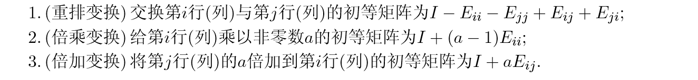

**矩阵的一次行初等变换相当于左乘一个初等矩阵, 而矩阵的一次列初等变换相当于右乘一 个初等矩阵.** 

**目的:** 将矩阵化为**Hermite型**

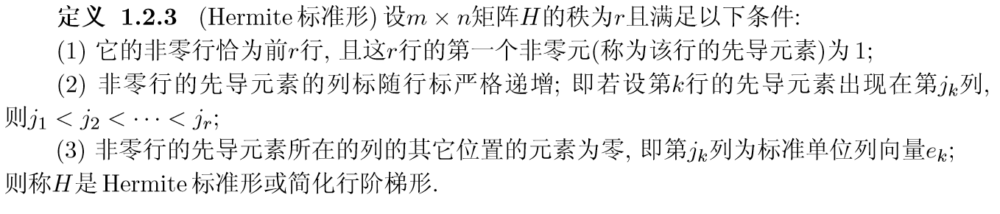

若$H_A = PA$, 则$Ax = b$与$H_A x = Pb$同解

### 满秩分解

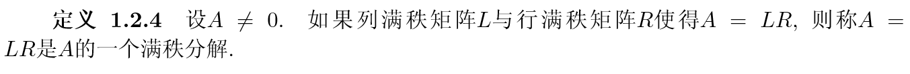

**可用于计算小秩矩阵的高次幂**

不唯一, 矩阵L与R的秩显然等于矩阵A的秩.

**Proof:**
$$
r(L_{m\times p})+r(R_{p\times n})-p\leq r(A_{m\times n})\leq \min\{r(L),r(R)\}
$$
由于L列满秩, R行满秩, 秩均为p 
$$
p\leq r(A)\leq p\\
r(A)=p
$$
**计算方法:**

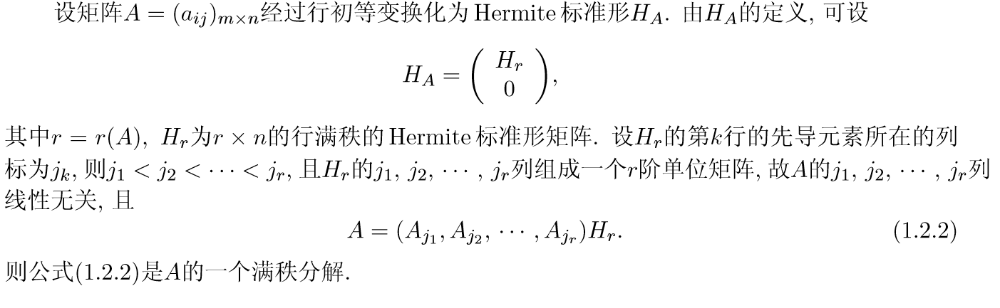

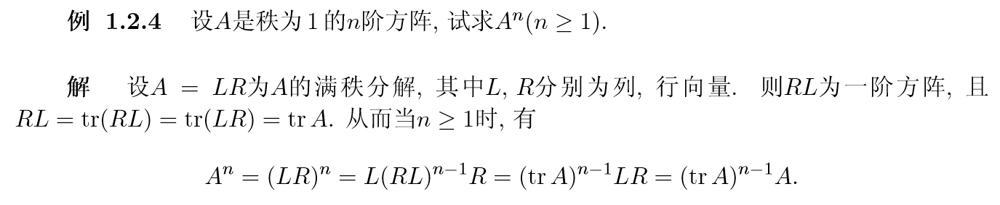

##  特征值与矩阵的相似对角化

对于大秩特别是满秩矩阵求高次幂, 使用对角化方法

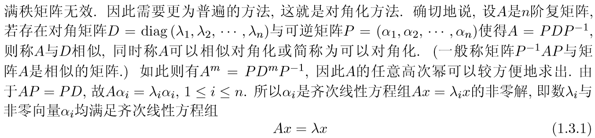

可知, 相似对角矩阵$D$的对角线元素即为$A$的特征值.

### 特征值

#### 几何重数

$n-r(\lambda_i I-A)$为特征值 $\lambda_i$的几何重数. 根据定理1.2.2  (齐次线性方程组的基本定理), 特征方程 $(\lambda_i I-A)x=0$ 的基础解系秩为$n-r(\lambda_i I-A)$, **即为对应特征向量的个数**

#### 代数重数

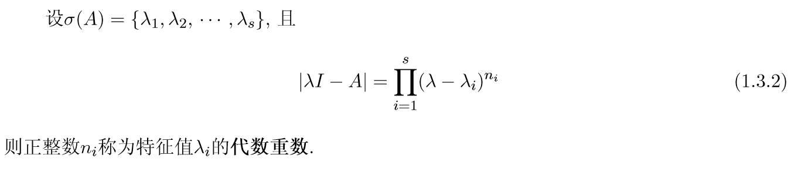

#### 谱半径

特征值的最大模称为A的**谱半径**, 记为ρ(A)
$$
\rho(A)=\max \{|\lambda| : \lambda \in \sigma(A)\}
$$
从几何上看, 矩阵A的特征值全部位于以原点为圆心, 谱半径ρ(A)为半径的圆盘内. 

#### 特征值性质

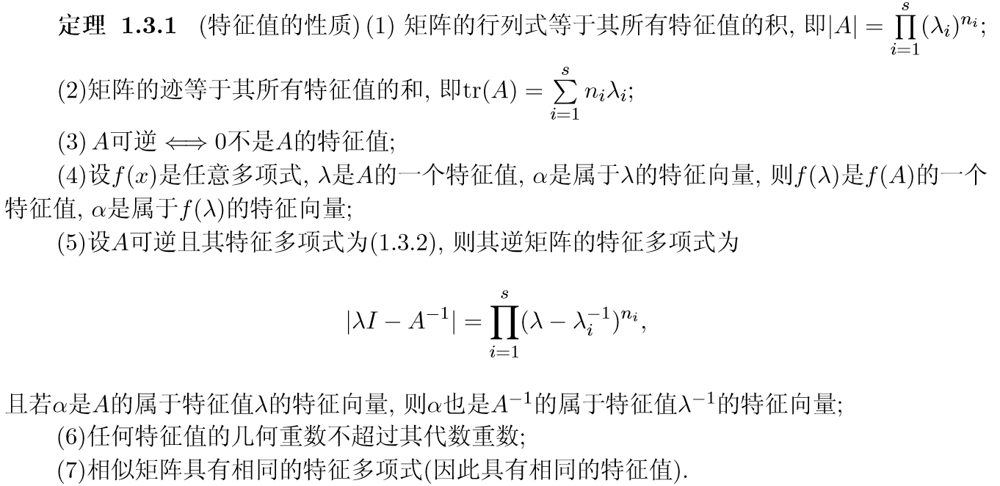

#### 特征向量的性质

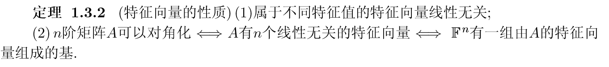

#### 对角化主定理

$$
A=PDP^{-1}
$$
这很好理解, 代数重数表示特征值重根的次数, 几何重数则是其对应的线性无关的特征向量的个数, 如果二者相等, 即说明 $A$ 具有 $n$ 个线性无关的特征向量, 这样 $P$ 才能是可逆矩阵, 对角化才存在.

## 线性空间

 $F^n$中的数乘满足下列四个条件(以下将$F^n$记为$V$ ): 

#### 线性空间定义

#### 过渡矩阵

矩阵$P = (p_{ij})$称为由$α$–基到$β$–基的**过渡矩阵**, 显然, 此时由$β$–基到$α$–基的过渡矩阵 为$P^{−1}$
$$
\left\{\begin{array}{l}{\beta_{1}=p_{11} \alpha_{1}+p_{21} \alpha_{2}+\cdots+p_{n 1} \alpha_{n}} \\ {\beta_{2}=p_{12} \alpha_{1}+p_{22} \alpha_{2}+\cdots+p_{n 2} \alpha_{n}} \\
\dots\\ {\beta_{n}=p_{1 n} \alpha_{1}+p_{2 n} \alpha_{2}+\cdots+p_{n n} \alpha_{n}}\end{array}\right.
$$

$$
\left(\beta_{1}, \beta_{2}, \cdots, \beta_{n}\right)=\left(\alpha_{1}, \alpha_{2}, \cdots, \alpha_{n}\right) P
$$

#### 坐标变换公式

## 内积空间与正定二次型

并非每个矩阵都可以对角化, 但任何实对称矩阵却可以以更精细的方式对角化

### 内积空间

#### 定义

有限维实内积空间又称为欧几里得空间或**欧氏空间**; 当F = C是复数域, 则内积空间称为**酉空间**(或复内积空间). 

#### 内积和范数的性质

对内积空间V 的任意一组基$\alpha_{1}, \alpha_{2}, \cdots, \alpha_{n}$, 利用`Gram-Schmidt`正交化方法可求得V 的 一个标准正交基. 

#### 投影向量

#### 酉矩阵

$Q^* Q=I$

酉矩阵的逆矩阵就是其共轭转置矩阵! 

#### Herimite矩阵

复共轭对称矩阵  $A^*=A$

### 正定

#### Hermite矩阵性质

#### 内积与正定矩阵

有限维实或复线性空间上的任意 两个内积**本质上是完全相同的**!

# 第二章 矩阵与线性变换

## 子空间: 直和与空间分解

#### 线性映射

线性映射 $\sigma : x → Ax $应满足:  (加法, 数乘封闭)

#### 子空间

**判别:** (检验加法, 数乘封闭性)

注意: 子空间必然包含0向量

**子空间的和**

一般来说, 两个子空间的并集$U ∪W$不再是子空间 因为有可能不是**凸集**? 所以说空间应该是**凸集**

那么包含U与W的最小的子空间 应为U与W的**凸包** 记作 $U+W$ , 称为U与W的**和**

#### 维数定理

设V是线性空间，U与W是V的两个子空间，则
$$
dim(U+W)=dimU+dimW-dim(U \cap W)
$$
**Proof:**

#### 直和

欲使子空间U+W的维数最大，必须且只要$U\cap W=0$，亦即U和W重合的部分最小，为零空间。这时称U+W是**直和**，记为$U\oplus W$。因此
$$
dim(U\oplus W)=dimU+dimW​
$$
**判别:**

#### 补空间

 $V=U\oplus W$，则W是U的补子空间。                                                                                                       补空间不唯一（反例：二维空间中两个相交在原点的向量）

1. 基的扩充定理
2. 
3. 如果是直和，则任意$\gamma\in U+W$可以唯一由U和W中的两个元素表示，并且零向量也表示唯一（反证法），这三个命题等价。

### 四个子空间
1. 零空间$N(A)$：齐次线性方程组$Ax=0$的解空间
2. 列空间$R(A)$（像空间、值域）：**A的列向量生成的子空间, 以列向量中的极大线性无关组为基**
3. 行空间$R(A^T)$：**A的行向量生成的子空间, 以行向量中的极大线性无关组为基**
4. 左零空间$N(A^T)$：线性方程组$y^TA=0$或$A^Tx=0$的解空间

**矩阵的秩就是行空间和列空间的秩, 因此, 其解空间(即为零空间) 秩为 $n-r(A)$.**

**计算方法:**

## 线性变换

线性变换应满足可加性和齐次性，U到V的线性变换全体记为$Hom(U, V)$ 
1. **核：** “零点”集$ \{\alpha \in U: \sigma(\alpha)=0\} $，记作$Ker(\sigma)$或$\sigma^{-1}(0)$

2. **像：** “函数值”的集合$\{\alpha \in V: \exists \beta \in U, 使得\alpha=\sigma(\beta)\}$，记作$Im(\sigma)$或$\sigma(U)$

3. $Ker\sigma和Im\sigma$分别是U和V的子空间，其维数记作$\eta (\sigma)与r(\sigma)$, 称为 $\sigma$ 的**零度与秩**
    **理解：** 线性变换$\sigma=Ax$对应矩阵A，零变换对应零矩阵，恒等变换对应恒等矩阵；变换的核与矩阵零空间$N(A)$有关，像与矩阵的列空间$R(A)$。当选取标准基时，线性变换几乎就是左乘一个矩阵A，进一步，设$A=(a_{ij})$，则
    $$
\begin{align*}
    \sigma(\alpha)&=A(x_1, x_2, \dots, x_n)^T\\
&=(a_{11}x_1+a_{12}x_2+\dots+a_{1n}x_n,\dots,a_{n1}x_1+a_{n2}x_2+\dots+a_{nn}x_n)^T \\&=(\sigma_1(\alpha),\dots,\sigma_n(\alpha))
    \end{align*}
    $$
    即线性变换不过是多个多元线性函数
    
4. **不同基下的矩阵的关系：** 设$\alpha和\beta$是U的两组基，P是由$\alpha-基到\beta-基$的过渡矩阵；设$\alpha’和\beta’$是V的两组基，Q是由$\alpha’-基到\beta’-基$的过渡矩阵；设$\sigma\in Hom(U,V)$关于$\alpha-基和\alpha’-基$的矩阵为A，关于$\beta-基 和\beta’-基$的矩阵为B：
    $$
    B=Q^{-1}AP
    $$
    假定U=V且$\alpha-基等于\alpha’-基$，$\beta-基等于\beta’基$，于是：
$$
    B=P^{-1}AP​
$$
​		则A与B**相似**, 即它们不过是同一线性变换在不同基下的矩阵而已, 而矩阵P不过是两个基之间的过渡矩阵. 

#### 同构

 $\sigma: U\rightarrow V$ 既是单射又是满射；两个空间不仅元素对应，运算也对应；并且**维度相同**

同构映射相当于重起名字, 本质上没有改变空间结构

#### 矩阵与线性变换

## 内积空间的正交分解

#### 正交补

在内积空间中, 每个子空间除去有无穷多个补子空间外, 还有唯一一个“**好的**”补子空间, 即所谓 **正交补**.

#### 投影向量

是$β$在$v$上的投影向量$Proj_vβ$
$$
\hat{\beta}=\frac{(\beta, v)}{(v, v)} v
$$

#### 最佳近似

<strong style="background:#FFA500">$β$在子空间$U$中的最佳近似(向量)就是$U$中与$β$最近(距离最短)的向量, 这样的向量一定存在而且唯一</strong>

**求解:**

求向量$β$在子空间U中的最佳近似向量, 等价于求$β$在直和分解$V = U ⊕U^⊥$下的表达式, 即若$β = α + γ$, 其中$α ∈ U, γ ∈ U^⊥$, 则$α$就是$β$在$U$上的最佳近似向量 $\hat{\beta}$. 

<strong style="background:#FF7F50">此处应注意: 需要时正交基</strong>

#### 正规化方程

<strong style="background:#87CEFF">对于矛盾方程来说, 对任意 $x\in \mathbb{R}^n$, $Ax\neq b$, 要求其最优解 $Ax^0$ 即是求 $b$ 在矩阵 $A$ 的值空间 $R(A)$ 中的最佳近似向量. 由最佳近似定理可知, $b-Ax^0\in R(A)^{\perp}=N(A^T)$.</strong> 因此向量 $b-Ax^0$ 满足 $A^T(Ax^0-b)=0$, 即 $x^0$满足:
$$
A^{T} A x=A^{T} b
$$
即为**正规化方程**, 经过变换后,方程总是相容的, 最优解总是存在.

<strong style="background:#FF7F50">对于非正交基的问题, 通过求解正规化方程来解最佳近似向量</strong>

## 内积空间中的线性变换

本节探讨 线性变换是否会影响长度, 角度和距离

#### 等距变换/正交变换

在标准正交基下的等距变换 $\iff$ 该标准正交基下的变换矩阵为酉矩阵

因此欧氏空间的**等距变换**又称为 **正交变换** ; 而复内积空间的等距变换也称为 **酉变换**

但是等距变换在一般基下的矩阵未必是酉矩阵

等距变换保持长度和内积, 从而也保持向量之 间的角度, 因此等距变换不改变图形的形状,  但一般的线性变换则可能将图形变得面目全非

#### Householder变换

容易看出, Householder变换$H_v$实际上是关于超平面$v^⊥$的镜面反射

#### Givens变换

#### 对称变换

#### 正交分解

# 第三章 特征值与矩阵的Jordan标准形

## Schur 三角化定理

#### Schur酉三角化定理

Schur三角化定理是化简矩阵的基础, 用于计算方阵的任意次幂 $A^m$ 

<strong style="background:#FF7F50">对于任意复方阵,都能找到一个酉矩阵将其化为上三角矩阵</strong>

#### 分块Schur 三角化定理

<strong style="background:#FF7F50">将寻求矩阵标准形的问题化为寻找主对角元素均相同的上三角矩阵的标准形</strong>

设A是$n$阶严格上三角矩阵 (对角线也为0) , 则$A^n = 0$.

#### Cayley-Hamilton

因此, 可以证明`Cayley-Hamilton`定理, 即设矩阵$A$的特征多项式为$f(λ),$ 则有$f(A) = 0$.
$$
f(A)=\left(A-\lambda_{1} I\right)^{n_{1}}\left(A-\lambda_{2} I\right)^{n_{2}} \cdots\left(B-\lambda_{s} I\right)^{n_{s}}
$$

#### Sylvester降幂公式

### 最小多项式 零化多项式

#### 性质

1. 设$m(x)$是$A$的最小多项式, $f(x)$是$A$的任意零化多项式, 则$m(x)|f(x)$. 特别地, $m(x)||xI −A|$. 
2. 设$A$是任意方阵, $m(x)$是$A$的最小多项式. 设$λ_0 ∈C$. 则$λ_0$是$A$的特征值 $⇐⇒$ $m(λ_0) = 0.$
3. 矩阵A是幂零矩阵 $⇐⇒ A$的特征值均为$0$.
4. **分块对角矩阵的最小多项式等于各个子块的最小多项式的最小公倍式(对照: 分块对角矩阵的特征多项式等于各个子块的特征多项式的乘积)**.
5. 相似矩阵具有相同的最小多项式.
6. **矩阵A可以对角化 ⇐⇒ A的最小多项式没有重根.**
7. 设A为方阵, f(x)是无重因式的多项式. 若f(A) = 0, 则A可以对角化.

#### 线性变换的特征值与特征向量

**特征向量是在线性变换下不改变方向的那些非零向量, 而特征值则是特征向量的伸缩系数.**  注意线性变换在其每个特征子空间上的限制是一个位似, 因此特征值与特征向量具有简化线性变换的矩阵表示的作用. 确切地说, 如果有限维线性空间 $V$ 有一组基其基向量全部为$σ$的特征向量, 则$σ$在这组基下的矩阵是对角矩阵

因此, 可以将矩阵的特征值, 特征向量求解问题转化为空间线性变换

## Jordan 标准形

根据分块Schur三角化定理, 可将矩阵转化为
$$
A=\lambda I+N
$$
$N$为严格上三角, 因为
$$
P^{-1} A P=\lambda I+P^{-1} N P
$$
故只需研究严格上三角的标准形. 即为Jordan 标准形 $J_n$

### 幂零矩阵的Jordan标准形定理

 设A是n阶严格上三角复矩阵. 则存在可逆矩阵P和正整数$n_1 ≥ n_2 ≥···≥ n_m, n_1 + n_2 + ···+ n_m = n$, 使得
$$
P^{-1} A P=J_{n_{1}} \oplus J_{n_{2}} \oplus \cdots \oplus J_{n_{m}}
$$
上式右端的矩阵称为 **幂零Jordan矩阵**, 它是矩阵A的Jordan标准形, 一般记为$J$. 如果不计诸$n_j$的次序与大小, 则A的Jordan标准形是唯一的.

#### 幂零矩阵相似准则

设$M$与$N$是两个$n$阶幂零矩阵. 则$M$与$N$相似 $⇐⇒ r(M^k) = r(N^k),∀k ≥1$

矩阵$λI_n +J_n$称为n阶$λ-Jordan$块, 记为$J_n(λ)$.

### Jordan标准形定理

设A是n阶严格上三角复矩阵. 则存在可逆矩阵P和正整数$n_1 ≥ n_2 ≥···≥ n_m, n_1 + n_2 + ···+ n_m = n$, 使得
$$
P^{-1} A P=J_{n_{1}}\left(\lambda_{1}\right) \oplus J_{n_{2}}\left(\lambda_{2}\right) \oplus \cdots \oplus J_{n_{m}}\left(\lambda_{m}\right)
$$
上式右端的矩阵称为**Jordan矩阵**, 它是矩阵A的**Jordan标准形**. 如果不计诸nj的次序与大小, 则A的Jordan标准形是唯一的.

**方阵A可以对角化 ⇐⇒ A的Jordan标准形是对角矩阵**

但是根据定义求特征值再求Jordan形太麻烦,  具体计算如下

## Jordan标准形计算

1. 对阶数较小的幂零矩阵可以通过其幂零指数和秩来确定其Jordan标准形: **最大Jordan块**
2. 对高阶矩阵, 需要更加精细的方法: 

#### 最大Jordan块

设A是严格上三角矩阵, 则其Jordan标准形的**Jordan块的阶数的最大值等于其幂零指数**.

#### 高阶矩阵方法

## 盖尔圆定理

盖尔圆用于特征值估计

#### 精细圆盘定理

设$C$是盖尔区域的一个由$k$个圆盘组成的连通分支, 则$C$恰好含有k个特征值.

# 第四章 正规矩阵和矩阵分解

<strong style="background:#FF7F50">矩阵分解是用于简化矩阵计算, 快速计算矩阵高次幂</strong>

我们首先探讨一种特殊的"好矩阵"——**正规矩阵**. 由于根据Schur三角化定理, 任何一个矩阵都可以**酉三角化**, 因此可以**酉对角化**的才算是好矩阵.

## 正规矩阵

**定理4.1.1** 矩阵 $A$可以 **酉对角化** $\Longleftrightarrow$ $AA^*=A^*A$

**定义4.1.1** 设 $A\in C^{n\times n}$，若 **$AA^*=A^* A$**，则称 $A$为 **正规矩阵**

1. 实对称: $A=A^T$
2. 实反对称: $A=-A^T$ (**注意**: 反对称阵必定对角线全为0)
3. 正交: $AA^T=I \Longleftrightarrow A^T=A^{-1}$
4. Hermite: $A=A^*$ (即复对称矩阵)
5. 反Hermite: $A=-A^*$ (即复反对称矩阵)
6. 酉矩阵: $AA^*=I\Longleftrightarrow A^* =A^{-1}$ (即复正交矩阵)

**引理4.1.1** 设 $A$ 为正规矩阵，若 $A$ 又为三角矩阵，则 $A$ 为对角矩阵

**定理4.1.2** 设 $A\in C^{n\times n}$，则 $A$ 为正规矩阵 $\Longleftrightarrow$ $A$ 有n个两两正交的单位特征向量

**推论4.1.1** 正规矩阵属于不同特征值的特征向量是相互正交的

**定理4.1.3** 设 $A=(a_{ij})_{n\times n}$ 是复矩阵，$\lambda_1, \lambda_2,\ldots,\lambda_n$为 $A$的 $n$ 个特征值，则

1. （**Schur不等式**）$\sum_{i=1}^n\lvert \lambda_i \rvert^2 \leqslant \sum_{i,j=1}^n \lvert a_{ij} \rvert^2$
2. $A$为正规矩阵 $\Longleftrightarrow \sum_{i=1}^n|\lambda_i|^2=\sum_{i,j=1}^n \lvert a_{ij} \rvert^2$ 

> Proof: 
>
> 根据Schur定理, $U^*AU=B$ , $B$为上三角
>
> 1. 若 $A$为正规矩阵, $B$为对角矩阵, 且$U^*AA^*U=BB^*$
>    $$
>    \begin{align*}
>    tr(AA^*)=\sum_{i,j=1}^n \lvert a_{ij} \rvert^2​\\
>    tr(BB^*)=\sum_{i=1}^n\lvert \lambda_i \rvert^2\\
>    tr(BB^*)=tr(AA^*)\\
>    So \qquad \sum_{i=1}^n|\lambda_i|^2=\sum_{i,j=1}^n \lvert a_{ij} \rvert^2
>    \end{align*}
>    $$

 ## 矩阵分解

- 正交三角分解

- 三角分解（方阵）

- 谱分解（必须是可对角化的方阵）

- 奇异值分解（极分解）

- 满秩分解

  > 化为Hermite型，P9 定义1.2.4

### 正交三角分解(UR分解)

> 一种对任何可逆矩阵均存在的理想分解，其原理是Gram-Schmidt的正交化方法

**定理 4.4.1** 设$A ∈ C^{n×n}$, 且$A$为满秩的, 则存在**唯一**的**酉矩阵$U$**和**对角线元素都大于零的上三角矩阵$R$**满足
$$
A=UR
$$

#### 要求与性质

1. $A_{m\times n}$ ，不一定为方阵
2. $A$ 的列向量线性无关，**列满秩**
3. $A_{m\times n}=U_{m\times n}R_{n\times n}$，则 $U$ 的列向量构成一组标准正交向量组，$R$为对角线元素大于零的上三角
4. 此分解**唯一**
5. 复空间上为 $UR$ 分解, 实空间为 $QR $分解 

#### 定理证明（P136）

利用施密特正交化，再单位化

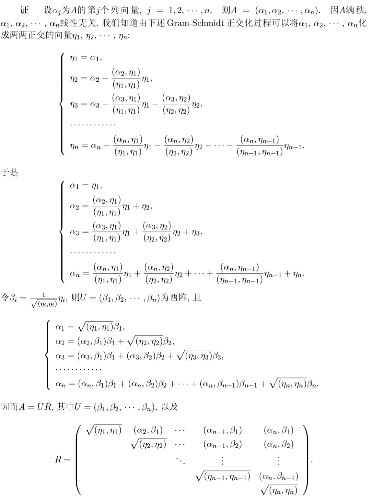

#### 唯一性证明（P137）

反证法，首先证明方阵

非方阵证明

### 谱分解或特征值分解

#### 要求与性质

1. $A_{n\times n}$  方阵 
2. 可对角化 $P^{-1}AP=diag(\lambda_1,\dots,\lambda_n)$

#### 计算方法

1. 计算特征值
2. 计算**单位正交特征向量** (因为是正规矩阵, 因此必存在n个正交特征向量)
3. 求正交投影矩阵 $P_i =\alpha_i \alpha^*_i$
4. $A=\sum_{i=1}^s \lambda_i P_i$

### 三角分解或LU分解

$$
A_{n\times n}=LU​
$$

其中，$L$为**单位下三角矩阵**，$U$为**上三角矩阵**

#### 要求与性质

1. 设$n$阶矩阵A的**前$r(A)$个顺序主子式均非0**, 则A存在三角分解
2. **实正定矩阵**一定存在三角分解

#### 作用

简化线性方程组的求解。设线性方程组 $Ax=b$ ，$A=LU$，则令 $y=Ux$即可将原方程化简为 $Ly=b$和 $Ux=y$ 两个简单的线性方程组

#### 唯一性

#### Cholesky分解

实正定矩阵一定存在三角分解，且两个三角矩阵互为转置，即存在唯一的对角元素均为正的下三角矩阵 $G$，使得 
$$
A=GG^T​
$$

#### 计算方法

将 $A$ 通过行初等变换化为上三角矩阵 $U$, 即左乘初等变换矩阵 $L^{-1}$
$$
L^{-1}A=U
$$
根据反变换的方式可以简单地求出 $L$, 即
$$
A=LU
$$

### 奇异值分解SVD

$$
A_{m\times n}=U_{m\times m}D_{m\times n}V_{n\times n}^*
$$

其中 $D=diag(\sigma_1,\sigma_2,\dots,\sigma_r,0,\dots,0)_{m\times n}$, $\sigma_i$为矩阵 $A$ 的奇异值(共n个)

#### 要求

**任意矩阵均有奇异值分解**

#### 定理

设 $A=(a_{ij})\in C^{m\times n}(m\ge n)$，且 $\sigma_1\ge \sigma_2\ge \dots \ge \sigma_r > 0$，则存在 $m$阶和 $n$阶的酉矩阵 $U$和 $V$，使得
$$
A=UDV^*
$$
其中 $D=diag(\sigma_1, \dots, \sigma_r,0,\dots,0)_{m\times n}$

$\sigma_1, \dots, \sigma_r,0,\dots,0$称为 $A$的 **奇异值**

#### 计算方法

1. 先求 $AA^*$ 、$A^*A$中阶数较小的矩阵的特征值 (因为$AA^*$ 、$A^*A$必定是正规)

2. 求其一组**标准正交特征向量**, $A^*A$为 $v_i$, $AA^*$为 $u_i$

3. 可依据上述条件求得另一个矩阵的特征值、特征向量（$AA^*$ 、$A^*A$的特征值、特征向量有关系）

   > 由于 $AV=UD$ , 因此
   > $$
   > A v_{i}=\left\{\begin{array}{ll}{\sigma_{i} u_{i},} & {1 \leq i \leq r} \\ {0,} & {r+1 \leq i \leq n}\end{array}\right.
   > $$
   > 与
   > $$
   > u_{i}^{*} A=\left\{\begin{array}{ll}{\sigma_{i} v_{i}^{*},} & {1 \leq i \leq r} \\ {0,} & {r+1 \leq i \leq m}\end{array}\right.
   > $$
   > 可得 $u_i=\dfrac{1}{\lambda_i}A^*v_i$

4. 奇异值是上述特征值的平方根

5. $U, V$分别是上述特征向量的组合

#### 几何意义

将$A_{m×n} = UDV^∗$看作是从$C^n$到$C^m$的线性变换, 则该线性变换

1. 首先(在$C^n$内)将向量$x$做一**旋转**而得到向量$V^∗x,$
2. 然后再(将$C^n$中的向量$V^∗x$)沿前$r = r(A)$个坐标做**伸缩**(其余坐标变为$0$)而得到($C^m$的) 向量$DV^∗x,$ 
3. 最后再(在$C^m$内)做一**旋转**而得到向量$UDV^∗x$. 比较正规矩阵的酉对角化可知, 此处的两次旋转可能不是互逆的. 

#### 性质

1. $AA^*$与 $A^*A$ 有完全相同的非零特征值(相同按重数计算) $\sigma_1^2,\sigma_2^2,\dots,\sigma_r^2$

2. $A, A^*$有相同的非零奇异值 $\sigma_1,\sigma_2,\dots,\sigma_r$

3. $A^{-1}=UD^{-1}V^*$, 奇异值为倒数

4. **条件数:** $Cond(A)=\sigma_1(A)/\sigma_n(A)$ (最大的除以最小的)

5. **正规矩阵**的奇异值是其**特征值的模**. 特别地, 半正定矩阵的特征值与奇异值相同.

6. **奇异值分解与矩阵的四个子空间**

   > 设$A = UDV^∗$是m×n矩阵$A$的一个奇异 值分解, $r = r(A)$, 则
   >
   > (1)酉矩阵$U$的前$r$列是$A$的列空间的一组标准正交基;
   >
   > (2)酉矩阵$V$ 的前$r$列是$A$的行空间的一组标准正交基; 
   >
   > (3)$U$的后$m−r$列是$A^∗$的零空间的一组标准正交基; 
   >
   > (4)$V$ 的后$n−r$列是$A$的零空间的一组标准正交基.

7. **奇异值与特征值**

   $σ_{max}(A)≥|λ|≥ σ_{min}(A)$. 换言之, 矩阵的最大奇异值与最小奇异值是其特征值的模的上下界. 

8. **奇异值与矩阵的迹**

   设$A ∈C^{m×n}$, 则 $tr(A^*A)=\sum^r_{i=1}\sigma_i^2$

9. **奇异值与奇异矩阵**

   矩阵$A$列满秩 $\Longleftrightarrow A$的奇异值均非0. 特别地, 方阵$A$非奇异 $\Longleftrightarrow A$ 的奇异值均非0. 

10. 非零奇异值的个数恰好是该矩阵的秩

## 极分解

**定理 4.5.2** 设$A ∈C^{n×n}$, 则存在酉矩阵U和唯一的半正定矩阵P使得
$$
A=PU上式称为矩阵A的 **极分解**. 矩阵P与U分别称为A的**Hermite因子与酉因子**.
$$

上式称为矩阵A的 **极分解**. 矩阵P与U分别称为A的**Hermite因子与酉因子**. 

其中, 当$A=U_1DV^*$, $P=U_1DU_1^*, U=U_1V^*$

#### 要求

1. 方阵

#### 几何意义

先旋转然后再沿着一组正交的方向做伸缩, 正如 $z=re^{i\theta}$一样

# 第五章 矩阵函数

## 向量与矩阵的范数

<strong style="background:#FF7F50">矩阵的范数可以看作是实数的绝对值 或者复数的模的推广, 是一种衡量矩阵(包括向量)大小的尺度</strong>

#### 赋范线性空间

ik

#### 常见的几种向量范数

$$
\begin{array}{l}{\text { (1) }\|x\|_{\infty}=\max _{1 \leq j \leq n}\left|x_{j}\right|}\qquad &(最大范数或l_\infty范数或\infty-范数) \\ {\text { (2) }\|x\|_{1}=\sum_{j=1}^{n}\left|x_{j}\right|} \qquad &(和范数或l_1范数或1-范数)\\ {\text { (3) }\|x\|_{2}=\left(\sum_{j=1}^{n}\left|x_{j}\right|^{2}\right)^{1 / 2}} \qquad &(欧几里得范数或l_2范数)\\ {\text { (4) }\|x\|_{p}=\left(\sum_{i=1}^{n}\left|x_{j}\right|^{p}\right)^{1 / p}, p \geq 1}\qquad &(Holder范数或l_p范数或p-范数)\end{array}
$$

Holder范数是范数的普遍形式, 可由其推广到其它三种范数. 为验证 $l_p$ 范数的三角不等式条件, 应用如下 **Minkowski不等式**
$$
\left(\sum_{j=1}^{n}\left|x_{j}+y_{j}\right|^{p}\right)^{1 / p} \leq\left(\sum_{j=1}^{n}\left|x_{j}\right|^{p}\right)^{1 / p}+\left(\sum_{j=1}^{n}\left|y_{j}\right|^{p}\right)^{1 / p}, \quad p \geq 1
$$

#### 矩阵的向量范数

$$
\begin{array}{l}{\|A\|_{F}=\left(\sum_{i, j=1}^{n}\left|a_{i j}\right|^{2}\right)^{1 / 2}=\sqrt{\operatorname{tr}\left(A^{*} A\right)}} \qquad &(Frobenius范数或F-范数) \\ {\|A\|_{1}=\max _{1 \leq j \leq n} \sum_{i=1}^{n}\left|a_{i j}\right|}& 极大列和范数 \\ {\|A\|_{\infty}=\max _{1 \leq i \leq n} \sum_{j=1}^{n}\left|a_{i j}\right|} &极大行和范数\end{array}
$$

#### 构造新范数

列满秩是为了防止 $Ax=0$ 有非零解, 导致 $||x||=0$ 不只在 $x=0$ 处有解, 违反赋范线性空间第一条

#### 向量范数之间的关系

两个范数等价 ⇐⇒ 它们具有相同的敛散性.

**定理 5.1.1** **有限维**线性空间中的任何两种向量范数都是等价的.

在有限维赋范线性空间中的微积分学本质上只有一种, 而在无限维赋范线性空间中则可以有不同的微积分学. 

#### 矩阵范数

#### 算子范数

**矩阵的1-范数恰好是向量的1-范数的诱导范 数, 而矩阵的$\infty$-范数恰好是向量的 $\infty$-范数的诱导范数** **矩阵2-范数是向量谱范数($\rho (A^*A)$)的诱导范数**

## 矩阵序列与矩阵级数

1. 先求Jordan阵
2. 再求 $P, P^{-1}$
3. 详细写出 $f(J)$

## 矩阵函数

 **待定系数法**

# 问题

1. 单位特征向量的求法
2. 四个子空间的求法
3. 无限维和有限维