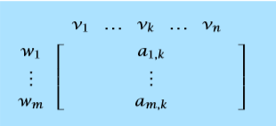
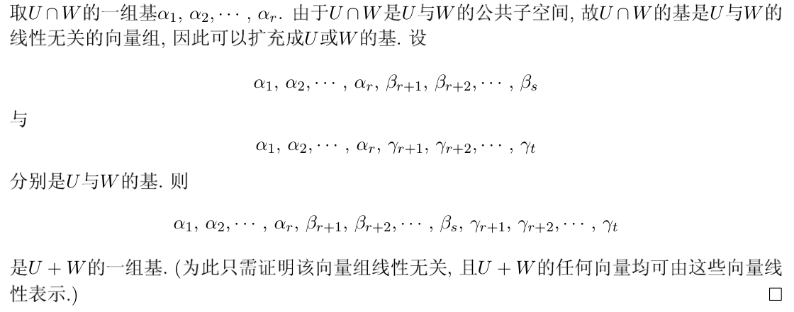

# 理解矩阵

1. [理解矩阵（一）](https://blog.csdn.net/myan/article/details/647511)
2. [理解矩阵（二）](https://blog.csdn.net/myan/article/details/649018)
3. [理解矩阵（三）](https://blog.csdn.net/myan/article/details/1865397)

**总结：**

- **“空间”是容纳运动的一个对象集合，而变换则规定了对应空间的运动。**
- **矩阵的本质是运动的描述。**
- **所谓变换，其实就是空间里从一个点（元素/对象）到另一个点（元素/对象）的跃迁**
- **矩阵是线性空间里的变换的描述，矩阵与向量相乘，就是实施运动（变换）的过程。**
- **矩阵是线性空间中的线性变换的一个描述。在一个线性空间中，只要我们选定一组基，那么对于任何一个线性变换，都能够用一个确定的矩阵来加以描述。**
- **所谓相似矩阵，就是同一个线性变换的不同的描述矩阵，它们的本质是一样的，所以本征值相同。**
- **矩阵不仅可以作为线性变换的描述，而且可以作为一组基的描述。而作为变换的矩阵，不但可以把线性空间中的一个点给变换到另一个点去，而且也能够把线性空间中的一个坐标系（基）表换到另一个坐标系（基）去。而且，变换点与变换坐标系，具有异曲同工的效果。（运动等价于坐标系的变换，即运动是相对的！）**

-------

# Linear Algebra Done Right

## Vector Spaces

1. A ***vector space*** is a set V along with an addition on V and a scalar
   multiplication on V such that the following **properties** hold:

   - **commutativity**

     ​	$u+v=v+u$ for all $u,v \in V$ ;

   - **associativity**

     ​	$(u+v)+w=u+(v+w)$ and $(ab)v=a(bv)$ for all $u,v,w \in V $ and all $a,b\in F$ ;

   - **additive identity** (must be unique)

     ​	there exists an element $0\in V$ such that $v+0=v$ for all $v\in V$

   - **additive inverse**  (must be unique)

     ​	for every $v\in V$, there exists $w\in V$ such that $v+w=0$ ;

   - **multiplication identity**

     ​	$1v=v$ for all $v\in V$ ;

   - **distributive properties**

     ​	$a(u+v)=au+av$ and $(a+b)u=au+bu$ for all $a,b\in F$ and all $u,v\in V$

   **Polynomial**  is also a vector space

2. **Propositions**:

   - $0v =0$ for every $v \in V$.
   - $a0=0$ for every $a∈F.$ 
   - $(−1)v =−v$ for every $v \in V$ .

   **Remember that the $0, -1$ above may not be the regular $0, -1$ as we known, they denote additive inverse and additive identity of the specific operation**(pending)

3. **Subspaces**：If $U$ is a subset of $V$, then to check that $U$ is a subspace of $V$ we need only check that $U$ satisfies the following: 

   - **additive identity** : $0∈U; $ 
   - **closed under addition** : $u,v ∈U $ implies $u+v ∈U; $
   - **closed under scalar multiplication** : $a∈F$ and $u∈U$ implies $au∈U$. 

   A subspace can be regard as a large space with some properties being limited

4. **Sums and Direct Sums**： Specifically, we say that $V$ is the direct sum of subspaces$ U_1 ,...,U_m$, 

   (1)  $V =U_1 ⊕···⊕U_m$, 

   (2) each element of $V$ can be written **uniquely** as a sum $u_1+\dots +u_m$, where each $u_j \in U_j$.

   **Proposition**: Suppose that $U$ and $W$ are subspaces of $V$. Then $V =U⊕W$ if and only if $V =U+W$ and $U∩W =\{0\}$.  (only with the case of two subspaces). 

   $$V =U⊕W  \Leftrightarrow  V =U+W  \&  U∩W =\{0\}$$

   

## Finite-Dimensional Vector Spaces

### Span and Linear Independence 

1. **The set of all linear combinations of $(v_1,...,v_m)$ is called the span of $(v_1,...,v_m)$, denoted $span(v_1,...,v_m)$.**

   $$span(v_1,...,v_m)=\lbrace a_1v_1+···+a_mv_m : a_1,...,a_m ∈F\rbrace. $$

    the span of any list of vectors in $V$ is a subspace of $V$.

2. **Infinite-dimensional** vector spaces are the center of attention in the branch of mathematics called *functional analysis*.

3. A list $(v_1,...,v_m)$ of vectors in $V$ is called **linearly independent** if the only choice of $a_1 ,...,a_m ∈F$ that makes $a_1 v_1 +···+a_mv_m$ equal $0$ is $a_1 =···=a_m =0.$

### Bases

A basis of $V$ is a list of vectors in $V$ that is linearly independent and spans $V.$ 

1. A list $(v_1,...,v_n)$ of vectors in $V$ is a basis of $V$ if and only if every $v ∈V$ can be written uniquely in the form

   $$ v =a_1v_1+···+a_nv_n$$

   where $a_1,...,a_n ∈F$.

2. Every spanning list in a vector space can be reduced to a basis of the vector space.

3.  Every linearly independent list of vectors in a finite-dimensional vector space can be extended to a basis of the vector space.

4.  Suppose $V$ is finite dimensional and $U$ is a subspace of $V$. Then there is a subspace W of $V$ such that $V =U⊕W.$

### Dimension

1. If $V$ is finite dimensional and $U$ is a subspace of $V$, then $dimU ≤dimV.$ 

2. If $U_1$ and  $U_2$ are subspaces of a finite-dimensional vector space, then 

   $dim(U_1+U_2)=dimU_1+dimU_2−dim(U_1∩U_2)$.

   - It is same as the number of elements in the union of  two finite sets: 
     $$
     n(A+B)=n(A)+n(B)-n(A\cap B)​
     $$

3. Suppose V is finite dimensional and $U1,...,Um$ are subspaces of V such that

   $$V =U_1+···+U_m$$ 

   and  

   $$dimV =dimU_1+···+dimU_m$$.

   Then $V =U_1⊕···⊕U_m$.

   Recall that direct sum is analogous to disjoint union. 

   - In sets:

     If $B=A_1 \cup \dots A_m$, and $n(B)=n(A_1)+\dots+n(A_m)$, then the union is a disjoint union.

## Linear Maps

### Definitions and Examples 

A linear map from $V$ to $W$ is a function $T$ : $V →W$ with the following properties: 

- **additivity** : $T(u+v)=Tu+Tv$ for all $u,v ∈V$; 
- **homogeneity** :  $T(av)=a(Tv)$ for all $a∈F$ and all $v ∈V.$ 

 For $S,T ∈L(V,W),$ 

- **associativity** 
   $$
   (T_1 T_2 )T_3 =T_1 (T_2 T_3 )​
   $$

- **identity** 

   $$
   TI=T​ and IT =T​
   $$

- **distributive properties** 
  $$
  (S_1 +S_2 )T = S_1 T +S_2 T and S(T_1 +T_2 ) = ST_1 +ST_2
  $$

- Multiplication of linear maps is **not commutative**. 

  $$
  ST \neq TS​
  $$

### Null Spaces and Ranges 

1. $null T ={v ∈V : Tv=0}$ 

   - If $T ∈L(V,W)$, then $null T$ is a subspace of $V$. 

   - Let $T ∈L(V,W)$. Then $T$ is **injective（单射）** if and only if $nullT ={0}$. 

     (A linear map $T: V → W$ is called injective if whenever $u,v ∈ V$ and $Tu = Tv$, we have $u = v$.)

2. $rangeT ={Tv: v ∈V}$

   -  If $T ∈L(V,W)$, then $rangeT$ is a subspace of $W$. 
   - A linear map $T: V → W$ is called **surjective（满射）** if its range equals $W$.

3. If $V$ is finite dimensional and $T ∈L(V,W)$, then $rangeT$ is a finite-dimensional subspace of $W$ and 

   $dimV =dim nullT +dimrangeT$

4.  If $V$ and $W$ are finite-dimensional vector spaces such that  $dimV>dimW$, then no linear map from $V$ to $W$ is **injective**. 
   $$
   dimnullT =dimV −dimrangeT \ge dim V-dimW >0
   $$

5.  If $V$ and $W$ are finite-dimensional vector spaces such that ,  $dimV<dimW$then no linear map from $V$ to $W$ is **surjective**.
   $$
   dimrangeT =dimV −dimnullT ≤dimV < dimW​
   $$
   

**Conclusions:**

1. A homogeneous system of linear equations in which there are more variables than equations must have nonzero solutions.

2. An inhomogeneous system of linear equations in which there are more equations than variables has no solution for some choice of the constant terms.

### The Matrix of a Linear Map

$$
M(T)=\left[
\begin{matrix}
a_{1,1} & \dots & a_{1,n} \\
\vdots &  & \vdots \\
a_{m,1} & \dots & a_{m,n}
\end{matrix}
\right]
$$

Let $T ∈L(V,W)$. Suppose that $(v_1,...,v_n)$ is a basis of $V$ and $(w_1,...,w_m)$ is a basis of $W$. 
$$
Tv_k =a_{1,k}w_1+···+a_{m,k}w_m,
$$
Sthe matrix of $T$ with respect to the bases $(v_1,...,v_n)$ and $(w_1,...,w_m)$; we denote it by 
$$
M(T,(v_1,...,vn),(w_1,...,w_m))
$$

$$
M(Tv)=\left[
\begin{matrix}
a_{1,1}b_1+ \dots+ a_{1,n}b_n \\
\vdots \\
a_{m,1}b_1+ \dots+  a_{m,n}b_n
\end{matrix}
\right]
$$

### Invertibility

A linear map $T ∈L(V,W)$ is called invertible if there exists a linear map $S ∈L(W,V)$ such that $ST$ equals the identity map on $V$ and $TS$ equals the identity map on W. 

-  A linear map is **invertible** if and only if it is **injective** and **surjective**. 

- Two vector spaces are called **isomorphic（同构）** if there is an invertible linear map from one vector space onto the other one.

  -  two isomorphic spaces have the same properties; 
  - we can think of an invertible linear map as a **relabeling** of the elements of a vector space. 
  - Two finite-dimensional vector spaces are isomorphic if and only if they have the **same dimension.**

-  If $V$ and W are finite dimensional, then $L(V,W)$ is finite dimensional and 
  $$
  dimL(V,W)=(dimV)(dimW).
  $$

- Suppose $V$ is finite dimensional. If $T ∈L(V)$, then the following are equivalent: 

  - $T$ is invertible; 
  - $T$ is injective;
  - $T$ is surjective.

## Polynomials

Recall that a function $p: F → F$ is called a polynomial with coefficients in $F$ if there exist $a_0,...,a_m ∈F$ such that 
$$
p(z)=a_0+a_1 z+a_2z_2+···+a_mz_m
$$

### Degree

1. If all the coefficients $a_0,...,a_m$ equal $0$, then we say that $p$ has degree $−∞$.

2. A polynomial may have **more than one** degree.

3.  A number $λ∈F$ is called a **root** of a polynomial $p∈P(F)$ if 
   $$
   p(λ)=0
   $$

4. Suppose $p ∈P (F)$ is a polynomial with degree $m ≥ 1$ . Let $λ ∈ F$. Then λ is a root of $p$ if and only if there is a polynomial $q∈P(F)$ with degree $m−1$ such that
   $$
   p(z)=(z−λ)q(z)
   $$

5. Suppose $p∈P(F)$ is a polynomial with degree $m≥0$. Then $p$ has at most $m$ distinct roots in $F$. 

6. Suppose $a_0,...,a_m ∈F.$ If 
   $$
   a_0+a_1 z+a_2z^2+···+a_mz^m =0
   $$
    for all $z∈F$, then $a_0 =···=a_m =0$. 

   It implies that $(1,z,\dots,z^m)$ is linearly independent in $P(F)$ for every nonnegative integer $m$.

7. **Division Algorithm:**  Suppose $p,q ∈P (F),$ with $p \neq 0$. Then there exist polynomials $s,r ∈P(F)$ such that 
   $$
   q=sp+r
   $$
   and $\deg r<\deg p$

## Eigenvalues and Eigenvectors

### Invariant Subspaces

1. For $T ∈L(V)$ and $U$ a subspace of $V$, we say that $U$ is **invariant under $T$** if $u ∈ U$ implies $Tu∈ U$. In other words, $U$ is invariant under T if $T|_U$ is an operator on $U$. 
2. If $T\in L(V)$, $null T$ and $range T$ is invariant under $T$.
3.  **Eigenvalue** : Specifically, a scalar $λ ∈ F$ is called an **eigenvalue** of $T ∈L(V)$ if there exists a nonzero vector  $u ∈ V$ such that $Tu= λu$.
4. The equation $Tu= λu$ is equivalent to $(T −λI)u = 0$, so $λ$ is an eigenvalue of $T$ if and only if $T −λI$ is **not injective**.  $λ$ is an eigenvalue of $T$ if and only if $T−λI$ is **not invertible**, and this happens if and only if $T −λI$ is **not surjective**. 
5.  **Eigenvector:** An operator has an eigenvalue if and only if there exists a nonzero vector in its domain that gets sent by the operator to a scalar multiple of itself.
6.  Let $T ∈L(V)$. Suppose $λ_1 ,...,λ_m$ are distinct eigenvalues of $T$ and $v_1 ,...,v_m$ are corresponding nonzero eigenvectors. Then $(v_1 ,...,v_m)$ is linearly independent.

### Upper-Triangular Matrices

1. Every operator on a finite-dimensional, nonzero,  complex vector space has an eigenvalue. 
2. Suppose $T ∈L(V)$ and $(v_1,...,v_n)$ is a basis of $V.$ Then the following are equivalent: 
   -  the matrix of $T$ with respect to $(v_1,...,v_n)$ is upper triangular; 
   -  $Tv_k ∈span(v_1,...,v_k)$ for each $k=1,...,n$ ; 
   -  $span(v_1,...,v_k)$ is invariant under T for each $k=1,...,n$ .
3. Suppose  $T ∈L(V)$ has an upper-triangular matrix with respect to some basis of $V$. Then $T$ is invertible if and only if all the entries on the **diagonal** of that upper-triangular matrix are **nonzero**.
4.  Suppose $T ∈L(V)$ has an upper-triangular matrix with respect to some basis of $V$. Then the **eigenvalues** of $T$ consist precisely of **the entries on the diagonal** of that upper-triangular matrix.

### Diagonal Matrices

1.  An operator $T ∈L(V)$ has a diagonal matrix with respect to some basis of $V$ if and only if $V$ **has a basis consisting of eigenvectors of** $T$. 

2.  If $T ∈L(V)$ has $dimV$ distinct eigenvalues, then $T$ has a diagonal matrix with respect to some basis of $V$.

3. Suppose $T ∈L(V)$. Let $λ_1,...,λ_m$ denote the distinct eigenvalues of $T$. Then the following are equivalent:

   - $T$ has a diagonal matrix with respect to some basis of $V$; 

   - $V$ has a basis consisting of eigenvectors of $T$; 

   - there exist one-dimensional subspaces $U_1,...,U_n$ of $V$, each invariant under $T$, such that $V =U_1⊕···⊕U_n$; 

   - $V =null(T −λ_1I)⊕···⊕null(T −λ_mI)$; 

     >  every vector in V is a linear combination of eigenvectors of T. Hence
     > $$
     > V =null(T −λ_1I)+···+null(T −λ_mI).
     > $$
     > $null(T- \lambda _mI)=\{x|(T-\lambda_mI)x=0\} $, where $x$ is the eigenvector of $\lambda_m$. Thus eigenvectors are linearly independent.  This implies  that the sum is a direct sum.

   -  $dimV =dimnull(T −λ_1I)+···+dimnull(T −λ_mI)$. 

### Invariant Subspaces on Real Vector Spaces

1. Every operator on a *finite-dimensional*, *nonzero*, *real vector space* has an invariant subspace of dimension **$1$ or $2$.**
2.  Every operator on an **odd-dimensional** real vector space has **an eigenvalue**.

## Inner-Product Spaces

### Inner Products

1. the **complex conjugate** of $λ$ is defined by $ \widetilde{\lambda}=a−bi$, 

2. $|λ|^2 =\lambda \widetilde{\lambda}$

3. **Properites** of *inner product*:

   - **positivity** 
     $$
     ⟨v,v⟩≥ 0  \quad \forall v ∈ V;
     $$

   - **definiteness** 
     $$
     ⟨v,v⟩=0 \quad iff \quad v =0;
     $$

   - **additivity in first slot** (also in second slot)
     $$
     ⟨u+v,w⟩=⟨u,w⟩+⟨v,w⟩\quad \forall u,v,w ∈ V;
     $$

   - **homogeneity in first slot** (also in second slot)
     $$
     ⟨av,w⟩=a⟨v,w⟩\quad \forall a∈ F \quad and \quad \forall v,w∈ V;
     $$

   - **conjugate symmetry** 
     $$
     ⟨v,w⟩=\widetilde{⟨w,v⟩}\quad  \forall v,w∈ V.
     $$

4. An ***inner-product space*** is a vector space V along with an inner product on V. 

### Norms

1. $ \lVert (z1 ,...,zn)\rVert=\sqrt{|z1|^2+···+|zn|^2}.$ 

2. $\lVert p\rVert=\sqrt{\int^1_0 |p(x)|^2dx} $ .

3. Two vectors $u,v ∈V$ are said to be orthogonal if $⟨u,v⟩=0$.

4. **Pythagorean Theorem**:  If u,v are orthogonal vectors in V,then 
   $$
   ∥u+v∥^2 =∥u∥^2+∥v∥^2.
   $$

5. **Cauchy-Schwarz Inequality**：If u,v ∈V, then
   $$
   |⟨u,v⟩|≤∥u∥∥v∥.
   $$
   This inequality is an equality if and only if one of $u,v$ is a scalar multiple of the other. 

6. **Triangle Inequality**: If $u,v ∈V$, then
   $$
   ∥u+v∥≤∥u∥+∥v∥.
   $$
   This inequality is an equality if and only if one of $u,v$ is a nonnegative multiple of the other.

7. **Parallelogram Equality**: If $u,v ∈V$, then 
   $$
   \lVert u+v\rVert^2 +∥u−v∥^2 =2 (∥u∥^2 +∥v∥^2 ).
   $$
   

# 第二章 矩阵与线性变换

### 维数定理
设V是线性空间，U与W是V的两个子空间，则
$$dim(U+W)=dimU+dimW-dim(U \cap W)$$
1. 基的扩充定理

1. 欲使子空间U+W的维数最大，必须且只要$U\cap W=0$，亦即U和W重合的部分最小，为零空间。这时称U+W是**直和**，记为$U\oplus W$。因此$dim(U\oplus W)=dimU+dimW$。
2. 如果是直和，则任意$\gamma\in U+W$可以唯一由U和W中的两个元素表示，并且零向量也表示唯一（反证法），这三个命题等价。
3. **补空间：** $V=U\oplus W$，则W是U的补子空间。                                                                                                       补空间不唯一（反例：二维空间中两个相交在原点的向量）

### 四个子空间
1. 零空间$N(A)$：齐次线性方程组$Ax=0$的解空间
2. 列空间$R(A)$（像空间、值域）：A的列向量生成的子空间
3. 行空间$R(A^T)$：A的行向量生成的子空间
4. 左零空间$N(A^T)$：线性方程组$y^TA=0$或$A^Tx=0$的解空间

### 线性变换
线性变换应满足可加性和齐次性，U到V的线性变换全体记为$Hom(U, V)$ 
1. **核：** “零点”集$ \{\alpha \in U: \sigma(\alpha)=0\} $，记作$Ker(\sigma)$或$\sigma^{-1}(0)$

2. **像：** “函数值”的集合$\{\alpha \in V: \exists \beta \in U, 使得\alpha=\sigma(\beta)\}$，记作$Im(\sigma)$或$\sigma(U)$

3. $Ker\sigma和Im\sigma$分别是U和V的子空间，其维数记作$\eta (\sigma)与\gamma(\sigma)$
    **理解：** 线性变换$\sigma=Ax$对应矩阵A，零变换对应零矩阵，恒等变换对应恒等矩阵；变换的核与矩阵零空间$N(A)$有关，像与矩阵的列空间$R(A)$。当选取标准基时，线性变换几乎就是左乘一个矩阵A，进一步，设$A=(a_{ij})$，则
    $$
\begin{align*}
    \sigma(\alpha)&=A(x_1, x_2, \dots, x_n)^T\\
&=(a_{11}x_1+a_{12}x_2+\dots+a_{1n}x_n,\dots,a_{n1}x_1+a_{n2}x_2+\dots+a_{nn}x_n)^T \\&=(\sigma_1(\alpha),\dots,\sigma_n(\alpha))
    \end{align*}
    $$
    即线性变换不过是多个多元线性函数
    
4. **不同基下的矩阵的关系：** 设$\alpha和\beta$是U的两组基，P是由$\alpha-基到\beta-基$的过渡矩阵；设$\alpha’和\beta’$是V的两组基，Q是由$\alpha’-基到\beta’-基$的过渡矩阵；设$\sigma\in Hom(U,V)$关于$\alpha-基和\alpha’-基$的矩阵为A，关于$\beta-基 和\beta’-基$的矩阵为B：
    $$
    B=Q^{-1}AP
    $$
    假定U=V且$\alpha-基等于\alpha’-基$，$\beta-基等于\beta’基$，于是：
$$
    B=P^{-1}AP​
$$
​		则A与B**相似**

5. **同构：** $\sigma: U-> V$ 既是单射又是满射；两个空间不仅元素对应，运算也对应；并且**维度相同**

# 第四章

## 正规矩阵

**定理4.1.1** 矩阵 $A$可以 **酉对角化** $\Longleftrightarrow$ $AA^*=A^*A$

**定义4.1.1** 设 $A\in C^{n\times n}$，若 $AA^*=A^* A$，则称 $A$为 **正规矩阵**

**引理4.1.1** 设 $A$ 为正规矩阵，若 $A$ 又为三角矩阵，则 $A$ 为对角矩阵

**定理4.1.2** 设 $A\in C^{n\times n}$，则 $A$ 为正规矩阵 $\Longleftrightarrow$ $A$ 有n个两两正交的单位特征向量

**推论4.1.1** 正规矩阵属于不同特征值的特征向量是相互正交的

**定理4.1.3** 设 $A=(a_{ij})_{n\times n}$ 是复矩阵，$\lambda_1, \lambda_2,\ldots,\lambda_n$为 $A$的 $n$ 个特征值，则

1. （**Schur不等式**）$\sum_{i=1}^n\lvert \lambda_i \rvert^2 \leqslant \sum_{i,j=1}^n \lvert a_{ij} \rvert^2$

 ## 矩阵分解

- 正交三角分解

- 三角分解（方阵）

- 谱分解（必须是可对角化的方阵）

- 奇异值分解（极分解）

- 满秩分解

  > 化为Hermite型，P9 定义1.2.4

### 正交三角分解(UR分解)

> 即是一种对任何可逆矩阵均存在的理想分解，其原理是Gram-Schmidt的正交化方法

#### 要求与性质

1. $A_{m\times n}$ ，不一定为方阵
2. $A$ 的列向量线性无关，列满秩
3. $A_{m\times n}=U_{m\times n}R_{n\times n}$，则 $U$ 的列向量构成一组标准正交向量组，$R$为对角线元素大于零的上三角
4. 此分解唯一

#### 定理证明（P136）

利用施密特正交化，再单位化

#### 唯一性证明（P137）

反证法，首先证明方阵

非方阵证明

### 谱分解或特征值分解

#### 要求与性质

1. $A_{n\times n}$ 

### 三角分解或LU分解

$$
A_{n\times n}=LU​
$$

其中，$L$为单位下三角矩阵，$U$为上三角矩阵

#### 作用

简化线性方程组的求解。设线性方程组 $Ax=b$ ，$A=LU$，则令 $y=Ux$即可将原方程化简为 $Ly=b$和 $Ux=y$ 两个简单的线性方程组

#### 唯一性

#### Cholesky分解

实正定矩阵一定存在三角分解，且两个三角矩阵互为转置，即存在唯一的对角元素均为正的下三角矩阵 $G$，使得 
$$
A=GG^T​
$$

### 奇异值分解SVD

$$
A_{m\times n}=U_{m\times m}D_{m\times n}V_{n\times n}^*
$$

#### 要求

任意矩阵均有奇异值分解

#### 定理

设 $A=(a_{ij})\in C^{m\times n}(m\ge n)$，且 $\sigma_1\ge \sigma_2\ge \dots \ge \sigma_r > 0$，则存在 $m$阶和 $n$阶的酉矩阵 $U$和 $V$，使得
$$
A=UDV^*
$$
其中 $D=diag(\sigma_1, \dots, \sigma_r,0,\dots,0)_{m\times n}$

$\sigma_1, \dots, \sigma_r,0,\dots,0$称为 $A$的 **奇异值**

#### 计算方法

1. 先求 $AA^*$ 、$A^*A$中阶数较小的矩阵的特征值
2. 求其一组标准正交特征向量 $v_i$
3. 可依据上述条件求得另一个矩阵的特征值、特征向量（$AA^*$ 、$A^*A$的特征值、特征向量有关系）
4. 奇异值是上述特征值的平方根
5. $U, V$分别是上述特征向量的组合

